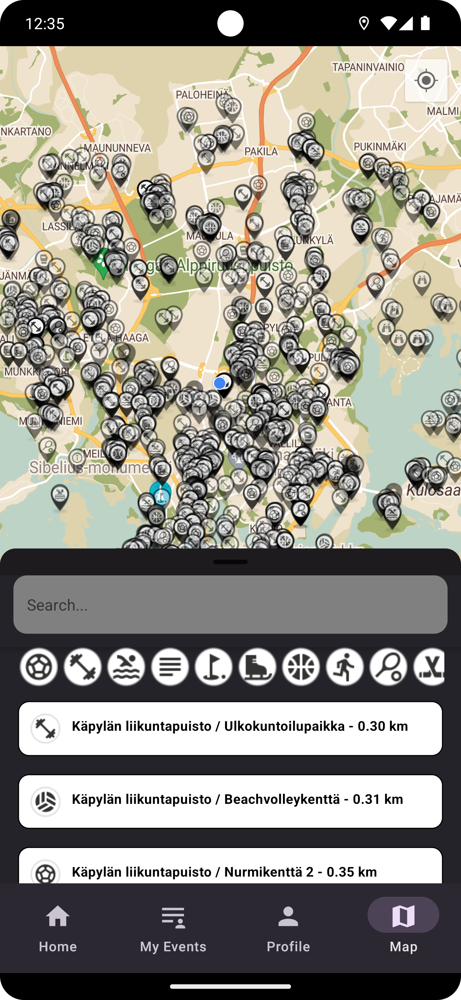
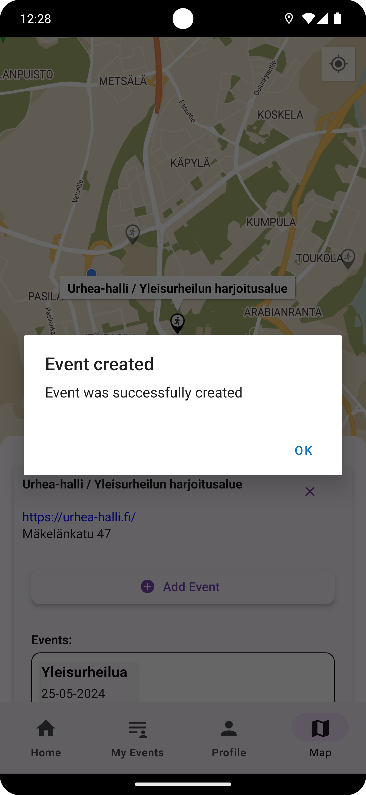
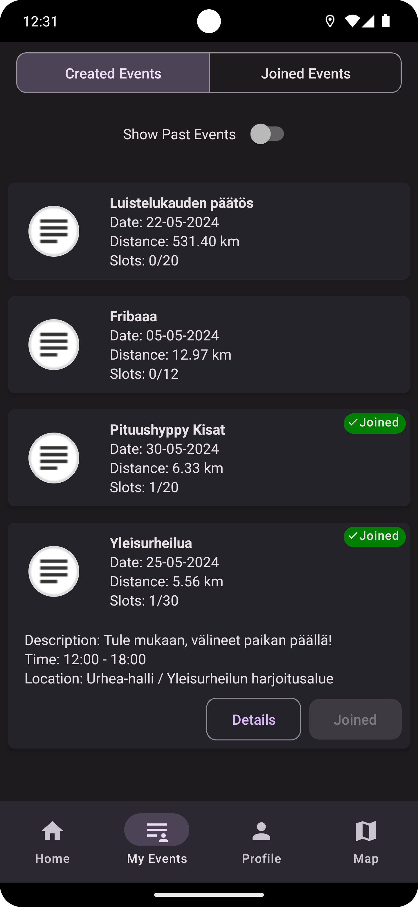

# Helip

Helip is a mobile application that provides users with a comprehensive view of all sports facilities in Finland.

The application is designed to facilitate users' exercise in the nearby area by providing a convenient way to find and explore different sports facilities.

## Interface

Current in-development screenshots:

<p float="left">
  
  
   
  
   
  
  
  
</p>

## Installation

Clone the repository and install the dependencies.

```bash
git clone https://github.com/kridesav/Helip.git
cd Helip
npm install
```

### Enviroment files

You will also need to create your own .env.local file into the root of the project.

Environment file template:

```bash
GOOGLE_API_KEY=
FIREBASE_API_KEY=
FIREBASE_AUTH_DOMAIN=
FIREBASE_DATABASE_URL=
FIREBASE_PROJECT_ID=
FIREBASE_STORAGE_BUCKETt=
FIREBASE_MESSAGING_SENDER_ID=
FIREBASE_APP_ID=
```

## Using the application

For running on a simulator on pc:

```bash
npx expo start
```
or alternatively using expo app on your phone:

```bash
npx expo start --tunnel
```

and scan QR-code from the terminal in your phones Expo app.

## Key Features
- Comprehensive sports facility information: Helip shows users all sports facilities in Finland, including gyms, sports fields, swimming pools, and other similar places.
- Events - Organize events with other people in your chosen location, be it some annual competition or just weekly excersize with other people.
- Lipas.fi data integration: We are using always up-to-date data from Jyväskylä University's public project that lists every existing sports venue/area.
- User-friendly interface: Helip is designed to be user-friendly and intuitive, so users can easily navigate and find the information they need.
- React + React Native: The application is developed using React and React Native, enabling an efficient and high-performance mobile experience.
- Developed with both Android and IOS in mind.

Helip makes finding sports facilities in Finland effortless and gives users the opportunity to enjoy a diverse range of sports offerings in the country.

## Dependencies

Location data from: [Lipas](https://lipas.fi/etusivu)

### Navigation
- [@react-navigation/bottom-tabs](https://www.npmjs.com/package/@react-navigation/bottom-tabs): ^6.5.12
- [@react-navigation/stack](https://www.npmjs.com/package/@react-navigation/stack): ^6.3.21

### Storage
- [@react-native-async-storage/async-storage](https://www.npmjs.com/package/@react-native-async-storage/async-storage): ^1.23.1

### Date and Time Picker
- [@react-native-community/datetimepicker](https://www.npmjs.com/package/@react-native-community/datetimepicker): ^7.6.1

### Bottom Sheet
- [@gorhom/bottom-sheet](https://www.npmjs.com/package/@gorhom/bottom-sheet): ^4.6.0

### Expo
- [expo](https://www.npmjs.com/package/expo): ~50.0.5
- [expo-location](https://www.npmjs.com/package/expo-location): ~16.5.3

### Firebase
- [firebase](https://www.npmjs.com/package/firebase): ^10.8.0

### UI Elements
- [react-native-elements](https://www.npmjs.com/package/react-native-elements): ^3.4.3
- [react-native-paper](https://www.npmjs.com/package/react-native-paper): ^5.12.3

### Maps
- [react-native-maps](https://www.npmjs.com/package/react-native-maps): 1.10.0

## Authors
Heinonen Tuukka - [Github](https://github.com/Tukkis)

Savolainen Kristjan - [Github](https://github.com/kridesav)

Virkki Perttu - [Github](https://github.com/perttuvirkki)

Teijo Virta - [Github](https://github.com/aksiooma)

Korostik Makar - [Github](https://github.com/makarkorostik)

## Links
[Project table](https://github.com/users/kridesav/projects/1)

[Backlog](https://github.com/users/kridesav/projects/1/views/2) 
 
[Backend](https://github.com/kridesav/Helip_backend)
